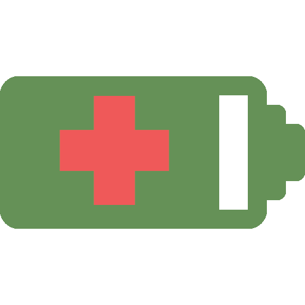
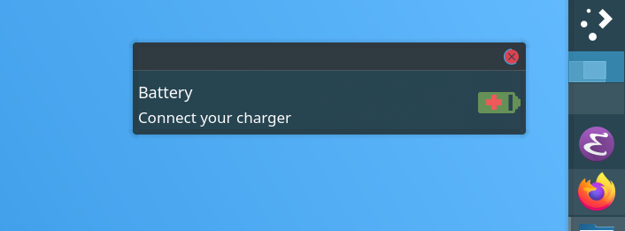

<p align="center">
     
</p>

Alerts you if your battery is overcharged or discharged to extend its performance and health.

Cross-platform compatibility:
- Windows.
- MacOS.
- Linux.
- FreeBSD.

# Preview

<p align="center">
     
</p>

# Install

```bash
git clone git@github.com:tanrax/alert-battery-to-maintain-health.git
cd alert-battery-to-maintain-health
poetry install
```

# Run

```bash
poetry run python3 src
```

# Cron

```bash
crontab -e
```

Add the following:

```bash
* * * * * 'cd [absolute path folder] && poetry run python3 src'
```
